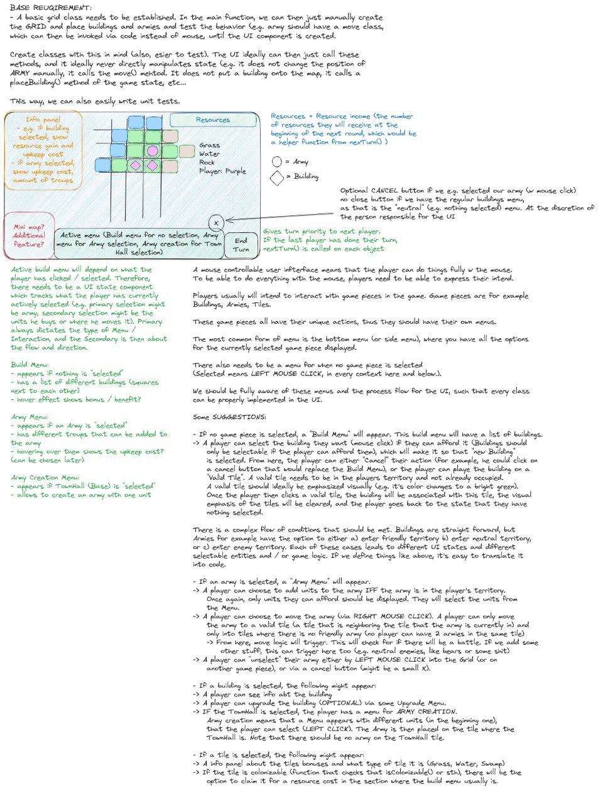

# Meeting Notes

In this file, you are required to take notes for your weekly meetings.
In each meeting, you are required to discuss:

1. What each member has done during the week?
2. Are there challenges or problems? Discuss the possible solutions
3. Plan for the next week for everyone
4. Deviations and changes to the project plan, if any

# Sprint Planning 31.10.2024

**Participants**:

1. Bădescu Alexia
2. Gefenitor Rudolf
3. Iwata Junya
4. Kanstrén Valtteri
5. Must Deniel

## Summary of works

The following can all also be seen in in the GitLab Issues under the Milestone "Project plan". We agreed on the contents of the project plan in our project kickoff sprint planning and assigned each team member to work on a part of the project plan and document what we agreed on. Here the distribution of tasks that followed:

1. Bădescu Alexia

   Assembling of project plan, including formatting, spell and grammar checking and prioritizing content to stay in page limit.

2. Gefenitor Rudolf

   Creation of high level structure, such as the main modules and classes. Creation of an UML to visualize Class relationships.

3. Iwata Junya

   Description of detailed plans for the sprints, including biweekly sprint planning and reviewing, occurance of dailies, GitLab workflow, etc..

4. Kanstrén Valtteri

   Investigating of external libraries, which includes a small proof of concept game to understand the role of SFML in our project.

5. Must Deniel

   Description of the scope of work, i.e. what features and functionalities will be implemented, how is it used and how does it work.

## Challanges

None

## Actions

Summary of ideation can be seen here:

We split the base requirements needed into seperate tickets and created a GitLab board to track all issues. We roughly assigned the issues to the responsible people. Project progress can thus be tracked via GitLab issues and their respective labels.

## Project status

The project just started. The general idea for it stands, and we know what to work on.

### TODOs

For the coming 2 weeks, everyone will work on the tickets such that ideally we finish all of the to the sprint assigned tickets.

# Daily Meeting 05.11.2024

**Participants**:

1. Bădescu Alexia
2. Gefenitor Rudolf
3. Iwata Junya
4. Kanstrén Valtteri
5. Must Deniel

## Summary of works

1. Bădescu Alexia

   Building class was almost completed, the only part missing was the integration with SFML for graphical rendering. Additionally, the Building class constructor was updated to automatically increment and assign unique IDs for every new instance of the Building class.

2. Gefenitor Rudolf

   GameState class was implemented, as well as the Player class and UI class. Furthermore, a utils file was created to make working on the UI easier. Here, simple functions to create basic Rectangles and Text were provided. A maploader was implemented, that takes as input a text file with 25 rows, each of which should be 20 chars long. Added everything to the main function and created an simple map to test other features with. Added some UI components such as the End Turn button and some resources in the top bar.

3. Iwata Junya
   The basic functionalities of Army class was implemented.

4. Kanstrén Valtteri

   The basic SFML build was set up for the project. The Tile class was then implemented, with features agreed on during the prior meeting. These include storing relevant variables with documented getters and setters. A test player class was also implemented to test showing player color. Some test code for the tiles was added to the main class, later replaced when GameState was implemented. The main project readme file was also updated with the relevant information from the project plan pdf.

5. Must Deniel

   Set up the work environment, started working on the implementation of the Townhall.

## Challenges

1. Bădescu Alexia
   No challeges. 
2. Gefenitor Rudolf

   No challanges.

3. Iwata Junya
   
   
4. Kanstrén Valtteri

   No challenges with implementations. Suggested we need to update meeting notes and get mouse input set up.

5. Must Deniel

   No challanges.

## Actions

> Please reflect these action decisions in your git commit messages so that
> your group members and advisor can follow the progress.

1. Bădescu Alexia

   I will continue to work on the building class

2. Gefenitor Rudolf

   Will continue working on the core UI components, such as click registration as this is the next big thing that needs to be implemented for a functioning game

3. Iwata Junya
   Will integrate Army into the UI.
   
4. Kanstrén Valtteri

   Will continue by choosing next issue(s) to resolve, and working on them. Right now assigned UI info box.

5. Must Deniel

   Will try to hopefully finish the whole implementation of Townhall and its UI.

## Project status

The project is still in it's early stages. Basic components are present, but it cannot yet be called a game.

### TODOs

All team members will continue to work on the carefully planned out tickets that were created in the sprint planning.

# Daily Meeting 07.11.2024

**Participants**:

1. Bădescu Alexia
2. Gefenitor Rudolf
3. Iwata Junya
4. Kanstrén Valtteri
5. Must Deniel

## Summary of works

1. Bădescu Alexia

I added the SFML for the building class and made some changes to it. 

2. Gefenitor Rudolf

   Continued working on the UI part. Added additional functions to create rectangles with outlines, fully implemented the resource bar with a connection to player resources and set up the initial click registration logic.

3. Iwata Junya
   Integrated Army into GameState and the UI handler. 

4. Kanstrén Valtteri

   Reviewed building MR, considered requirements for info box.

5. Must Deniel

   Finished the Townhall Class implementation and general logic. Also did the UI for it (it's a hexagon).
   Added some methods to the UI and gamestate, mainly for drawing. There are also some commands in main for testing.

## Challenges

1. Bădescu Alexia
   No difficulties. 

2. Gefenitor Rudolf
   No difficulties 

3. Iwata Junya
   Initially had difficulty rendering text on the UI. The issue was resolved by instantiating the font as a variable in UI class instead of inside getDrawable function in Army class. 

4. Kanstrén Valtteri
   The info box requires implementing something in the UI to tell what is currently selected. This will be resolved by implementing a Selectable class.

5. Must Deniel
   Figuring out how everything works and keeping the work logic straightforward and simple.

## Actions

1. Bădescu Alexia
   I will make some more changes to the building class. 
2. Gefenitor Rudolf
   Will continue working on the click event registration, such that team members can have an easy way to implement their class logic into the UI.
3. Iwata Junya
   Will implement movement of armies.
4. Kanstrén Valtteri
   Will implement the selectable class, and then can begin work on the info box.
5. Must Deniel
   Add logic in gamestate for figuring out where to place an army next to the townhall.
   Merging army and townhall and making them work together.
   Work on the turn logic.

> Please reflect these action decisions in your git commit messages so that
> your group members and advisor can follow the progress.

## Project status

The game is slowly coming together, some elemements are functional and visibly working. But is still very unfinished and there is no full game loop yet.

### TODOs

All team members will continue to work on the carefully planned out tickets that were created in the sprint planning.

# Daily Meeting 12.11.2024

**Participants**:

1. Bădescu Alexia
2. Gefenitor Rudolf
3. Iwata Junya
4. Kanstrén Valtteri
5. Must Deniel

## Summary of works

1. Bădescu Alexia

   All the functions related to drawing a bulding were moved into the ui.

2. Gefenitor Rudolf

   Continued working on UI by implementing the click registration logic after the selectable class was implemented. Created the bottom menu such that other team members only need to add in their own text values, added click registration for the appropriate fields and implemented a simple version of the build menu that works with the newly implemented UI state. Besides this, a refactor to the Builing logic was done (Farm, Wood Cutter, Mine, Market were added) and a new helper class for the build menu was added "Building Blueprint". Basic placements of different type of buildings was therefore possible. Army interaction should follow analogously.

3. Iwata Junya

   Implemented moving, merging, and combats of Army. 

4. Kanstrén Valtteri

   Implemented the selectable class, and made the relevant classes selectable. Then implemented the basic info box using selectable, to show names and labels.

5. Must Deniel

   Did some changes to the UI selected tile logic. Made the Townhall calculation for placing a soldier. Implemented most of the logic to be integrated with the UI, added basic turn logic.

## Challenges

1. Bădescu Alexia
   No challenges. 

2. Gefenitor Rudolf
   Some difficulties with the selectable class and how to store this in the UI state, though this was solved rather quickly.

3. Iwata Junya

   Noticed that the coordinate systems were misaligned. Reached a collective agreement to adopt the row-column system instead of the Cartesian coordinate system.

4. Kanstrén Valtteri
   The amount of files in src is becoming quite large, we should consider using subfolders. We can consider this at the next meeting if our branches are in good sync.

5. Must Deniel
   Understanding the selectable class.

## Actions

1. Bădescu Alexia

   Finished the building class. 

2. Gefenitor Rudolf
   Until the next sprint review, not much will be done by me. I will review MRs and help out where needed.
3. Iwata Junya

   Will complete the testing of combats and implement additional UI handlers for Army.

4. Kanstrén Valtteri
   Will continue infobox, and add a new utility method to draw a list of strings in a rectangle line by line. This will then be used for each class to show their info.
5. Must Deniel
   Merging my changes with the army and making them work together. Finish basic turn logic. Make the selectable UI part work.

> Please reflect these action decisions in your git commit messages so that
> your group members and advisor can follow the progress.

## Project status

The game now offers some interaction, and some proper logic for the implemented classes. By the end of the week, the game should be in a playable format where 2 players can face off against each other on the same machine.

### TODOs

All team members will continue to work on the carefully planned out tickets that were created in the sprint planning.

# Sprint Planning 14.11.2024

**Participants**:

1. Bădescu Alexia
2. Gefenitor Rudolf
3. Iwata Junya
4. Kanstrén Valtteri
5. Must Deniel

## Summary of works

The following can all also be seen in in the GitLab Issues under the Milestone "Project plan". We agreed on the contents of the project plan in our project kickoff sprint planning and assigned each team member to work on a part of the project plan and document what we agreed on. Here the distribution of tasks that followed:

1. Bădescu Alexia

   I added some buildings in the main file and checked how they work in the game. 

2. Gefenitor Rudolf

   Finished up some details on the UI. Reviewed MRs.

3. Iwata Junya

   Fixed the coordinates issue and finalized the basic implementation of the combat mechanics.

4. Kanstrén Valtteri

   Reviewed and merged an MR, then fixed it breaking the build. Started on the more complete infobox implementation.

5. Must Deniel

   Finished up the Townhall logic and UI, which is now almost fully implemented with some minor bugs.
   Changed some underlying logic in townhall to work with army and implemented some extra methonds in gamestate.

## Challenges

1. Bădescu Alexia

   No challenges. 

2. Gefenitor Rudolf

   None

3. Iwata Junya

   Had difficulty implementing the selection of an Army element. Learned how to assign to the variable selected_ a pointer to an existing Army object, which allows deselection through assigning a nullptr to the variable.

4. Kanstrén Valtteri

   A messed up merge to master resulted in the build breaking. Solved with a quick fix.

5. Must Deniel

   --

## Actions

1. Bădescu Alexia
   I worked on the building class. I removed the function drawBuilding() from the buildings class and added it to the ui class, I added addBuilding() and getVisibleBuilding() in the gamestate. I also made changes in UI::displayMap() to include buildings.

2. Gefenitor Rudolf

   Will work on the playerAI once the basic game features are implemented, like placing a building or moving an army, fighting etc..

3. Iwata Junya

   Will implement UI handlers by the end of the week so that players can move armies through UI. Will implement different types of army units as well as the victory condition in the next sprint.

4. Kanstrén Valtteri

   Will continue to work on the more completed infobox implementation. After that start on the next issues for a main menu and fog of war.

5. Must Deniel

   --

> Please reflect these action decisions in your git commit messages so that
> your group members and advisor can follow the progress.

## Project status

The game is currently in a playable state with the core gameplay logic fully implemented.
However, the game still resembles a prototype as several planned features are yet to be implemented, and there are known bugs that need to be addressed.
The next development phases will focus on refining gameplay elements, adding essential features, and enhancing stability to improve the overall user experience.

### TODOs

All team members who have not finished their issues will finish them this weekend and everyone will continue to work on the carefully planned out tickets that were created in the sprint planning.

# Daily Meeting 19.11.2024

**Participants**:

1. Bădescu Alexia
2. Gefenitor Rudolf
3. Iwata Junya
4. Kanstrén Valtteri
5. Must Deniel

## Summary of works

1. Bădescu Alexia

   I fixed several issues related to the buildings. The first issue was that the building was placed on the correct tile, but drawn on the wrong one, so in the drawBuilding() method, I made some adjustments. The second issue was that one the place building button was clicked, the user could place as many buildings as they want. To fix this, I made some modifications in processTileSelected() to allow the user to press only one building per mouse click. The third issue was that the player could place buildings anywhere. To fix this, I created the methods findBuildingByLocation, tileHasBuilding and canPlaceBuilding in gamestate and made modifications in the method processTileSelected to fix this. Now, a player can only place buldings on territory they own. The fourth issue was that when the building was placed, the resource cost associated with placing the building was not subtracted from the player's resources. This issue was solved by making a few changed in the method processTileSelected(). The final issue was that the player could place buildings even if they did not have any resources. Again, some changes were made in processTileSelected() to ensure that the player can only place buildings if they have the necessary resources to pay for it. 

2. Gefenitor Rudolf

   Started working on PlayerAI class.

3. Iwata Junya

   Implemented UI handlers for Army so that its movement, merge, and attack can be commanded through the interface.

4. Kanstrén Valtteri

   Added multiline functionality to the infobox to show the current selectable's getInfo return. Then implemented the visual part of fog of war, hiding tiles not seen by player's units. As a part of this fixed coordinates to be consistent, so X and Y are the same everywhere.

5. Must Deniel

   Unfortunately was unable to work on anything due to travelling abroad.

## Challenges

1. Bădescu Alexia

   I noticed some discrepancy between coordinates. 

2. Gefenitor Rudolf

   None

3. Iwata Junya

   None

4. Kanstrén Valtteri

   Coordinates were not consistent between the objects own X Y and getTile(x, y). Fixed to now be consistent.

5. Must Deniel

   None

## Actions

1. Bădescu Alexia

   I created the getInfo() and nextTurn() methods for the building class.

2. Gefenitor Rudolf

   Will continue working on PlayerAI class

3. Iwata Junya

   Will implement four different types of army through abstraction and inheritance.

4. Kanstrén Valtteri

   Will implement blocking UI interaction for fog of war hidden areas.

5. Must Deniel

   None

## Project status

--

### TODOs

--

# Daily Meeting 21.11.2024

**Participants**:

1. Bădescu Alexia
2. Gefenitor Rudolf
3. Iwata Junya
4. Kanstrén Valtteri
5. Must Deniel

## Summary of works

1. Bădescu Alexia

   I started working on the documentation for the building class. 

2. Gefenitor Rudolf

   Continued work on PlayerAI. Placing building logic and exploration via random movements.

3. Iwata Junya

   Implemented different army types so that they have different combat and motion capabilities.

4. Kanstrén Valtteri

   Made the UI block interaction with tiles hidden by fog of war.

5. Must Deniel

   Once again unable to work at all because of studying for an important exam abroad.

## Challenges

1. Bădescu Alexia

   None. 

2. Gefenitor Rudolf

   None

3. Iwata Junya

   Although initially attempted to implement army types with an abstract Army class and inherited concrete classes, eventually had to discard this approach due to a series of issues encountered.

4. Kanstrén Valtteri

   None

5. Must Deniel

   None

## Actions

1. Bădescu Alexia

   I started working on the documentation for the whole project. 

2. Gefenitor Rudolf

   Will implement a BFS algo to move armies to enemy townhalls. Refine AI logic a bit more.

3. Iwata Junya

   Will implement colonization and update recruitment.

4. Kanstrén Valtteri

   Implement the main menu

5. Must Deniel

   None

## Project status

--

### TODOs

--

# Daily Meeting 26.11.2024

**Participants**:

1. Bădescu Alexia
2. Gefenitor Rudolf
3. Iwata Junya
4. Kanstrén Valtteri
5. Must Deniel

## Summary of works

1. Bădescu Alexia

   I continued working on the documentation for the whole project. 

2. Gefenitor Rudolf

   Fully implemented PlayerAI, including the BFS algo and some pseudo random moves, until enemy base is encountered, after which the AI is deterministically pushing with all of it's armies for the enemy base to win the game.

3. Iwata Junya

   Implemented colonization, victory condition, and army recruitment cost.

4. Kanstrén Valtteri

   Implemented the main menu, and a UI management class to track what UI should be shown.

5. Must Deniel

   Implemented townhall functionality to work with new army types and their placing logic for separate types
   has also been sorted out.
   Next turn logic is also implemented with different army types and their costs.

## Challenges

1. Bădescu Alexia

   None

2. Gefenitor Rudolf

   None

3. Iwata Junya

   None

4. Kanstrén Valtteri

   None

5. Must Deniel

   The resources cannot go below 0 so there is a big bug rn where a player can just get a lot of army units
   after getting rich and he won't have to pay to upkeep them.

## Actions

1. Bădescu Alexia

   I looked into replacing the shape of the building with something else. 

2. Gefenitor Rudolf

   Everything is done, no actions needed on my end.

3. Iwata Junya

   Will improve the victory handling logic so that the game will terminate once the victory condition has been satisfied.

4. Kanstrén Valtteri

   Will look at the open merge requests, add small improvements to main menu, look at adding tests.

5. Must Deniel

   Will work on the map editor next.

## Project status

--

# Sprint Review 28.11.2024

**Participants**:

1. Bădescu Alexia
2. Gefenitor Rudolf
3. Iwata Junya
4. Kanstrén Valtteri
5. Must Deniel

## Summary of works

This sprint review concludes our project, besides some finishing touches. The team put great effort into the project, communicated well and consistently via Telegram, and thanks to good project management practices such as using GitLab boards, issues, and milestones, was able to finish this project well in advance as planned. We intentially set the finish line for this project earlier, in case we would have faced issues during development. Luckily, no major setbacks were encountered or refactors were required.

1. Bădescu Alexia

   Finished  working on all outstanding and assigned tickets

2. Gefenitor Rudolf

   Finished  working on all outstanding and assigned tickets

3. Iwata Junya

   Finished  working on all outstanding and assigned tickets

4. Kanstrén Valtteri

   Finished  working on all outstanding and assigned tickets

5. Must Deniel

   Finished  working on all outstanding and assigned tickets

## Challenges

No real challanges in the final days.

## Actions

No actions left for the team. We will collaboratively write up the Project Documentation and put some finishing touches on the project.

## Project status

The game and map editors are finished. The Game was showcased during the review to our TA and he provided us very positive feedback.

### TODOs

All team members will collaboratively work on the Project Documentation. The documentation will be spear headed by Alexia.

